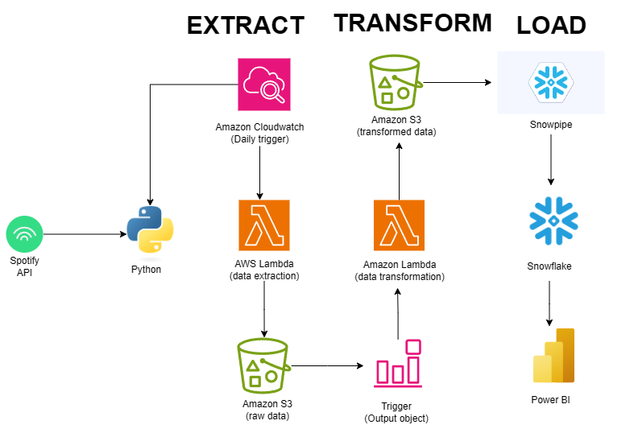

# snowflake_spotify_data_pipeline

# 🎵 Spotify Snowflake End to End ETL Datapipeline (Python, AWS, Snowflake)

## 📌 Overview
This project demonstrates an **end-to-end data pipeline** that extracts, processes, and loads Spotify’s Top 100 songs into Snowflake for analytics.  

The pipeline is fully automated using **Python, AWS Lambda, S3, and Snowflake Snowpipe**. It runs every hour, fetching the latest data from Spotify and making it available in Snowflake tables.

---

## 📊 Architecture / Data Pipeline


## 🚀 Architecture Workflow

1. **Data Extraction**
   - Python (Spotipy) is used in a Lambda function to fetch Top 100 songs from Spotify API.
   - Extracted raw data is flattened using Pandas and stored as JSON/CSV in an **S3 bucket**.

2. **Data Transformation**
   - A second Lambda function is triggered by S3 events.
   - The function transforms raw JSON into structured DataFrames using Pandas.
   - Processed data is stored in **separate S3 folders** (per entity: tracks, albums, artists).

3. **Data Loading into Snowflake**
   - Snowflake **stages, file formats, and tables** are created.
   - **Storage integration (IAM role)** securely connects Snowflake with S3.
   - **Snowpipe** is configured to auto-ingest processed CSV files from S3.
   - Whenever new files arrive, data is automatically loaded into Snowflake.

4. **Scheduling**
   - An hourly schedule triggers the Extract Lambda via **EventBridge (CloudWatch event rule)**.
   - End-to-end ingestion happens automatically.

---

## 📂 Project Structure
```
spotify-pipeline/
│── main.ipynb                     # Jupyter Notebook (local dev)
│── spotify_api_extract_function.py # Extracts data from Spotify → S3
│── spotify_transformation_function.py # Transforms raw data → CSV → S3
│── spotify_snowflake_datapipeline.sql # All Snowflake objects (tables, stage, snowpipe, etc.)
│── Spotify_snowflake_end_to_end_ETL_datapipeline.png # Architecture diagram
│── README.md
│── requirements.txt
│── credentials.txt
```

## 🔧 Tech Stack
- **Programming:** Python (Spotipy, Pandas, Boto3)
- **AWS Services:** Lambda, S3, EventBridge, IAM
- **Data Warehouse:** Snowflake (Stage, File Format, Storage Integration, Snowpipe)
- **Others:** Jupyter Notebook (for initial prototyping)

---

## 📝 How to Run Locally
1. Clone the repo:
   ```bash
   git clone https://github.com/annapoornishanthkumar/snowflake_spotify_data_pipeline.git

✨ Future Enhancements

* Add Airflow / Step Functions for orchestration
* Implement dbt for SQL-based transformations
* Add logging & monitoring (CloudWatch + SNS alerts)
* Build a dashboard (Tableau / Power BI) on top of Snowflake
